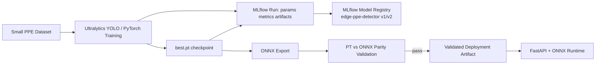
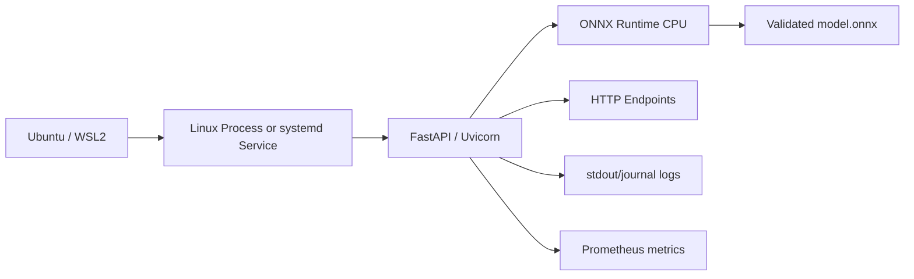
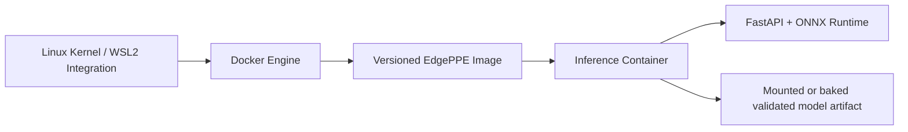
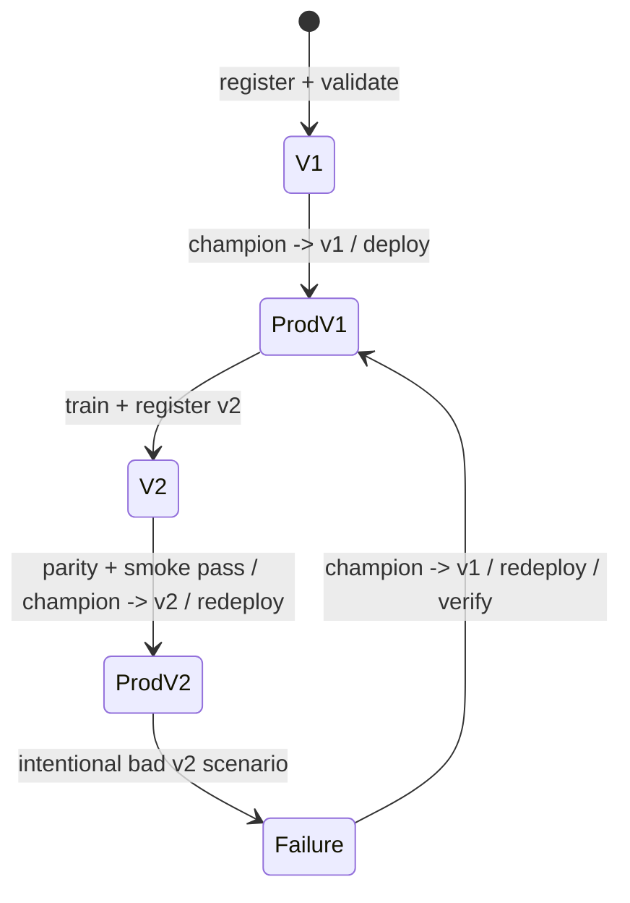
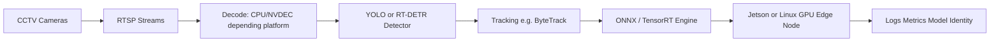

# 05 — Architecture

## Architecture principle

EdgePPE Lab has one training path and one inference service. MLflow provides tracking/registry; ONNX is the deployment representation; Linux is the runtime substrate. Docker is an alternative packaging/runtime layer after the manual Linux path is understood.

## 1. Development and training

## 2. Linux runtime

## 3. Docker runtime

Docker packages user space; it does not replace the Linux kernel, Linux networking, filesystems, process concepts, or host resource constraints.

## 4. Version lifecycle

## 5. Future production extension — illustrative, not employer-specific

This final diagram only shows a **publicly common production pattern**. It is not a claim about any company's private architecture.

## Artifact flow

| Artifact | Created by | Consumed by | Why it exists |
|---|---|---|---|
| Dataset version | data preparation | training | reproducible training input |
| `best.pt` | YOLO training | evaluation/export | selected training checkpoint |
| MLflow run | training workflow | registry/audit | params, metrics, lineage, artifacts |
| Registered version | MLflow Registry | release workflow | immutable model identity |
| `model.onnx` | export step | parity + serving | portable deployment graph |
| Parity report | validation | release gate | conversion evidence |
| Docker image | CI/local build | Docker runtime | versioned application package |
| Running process | Linux/systemd/Docker | HTTP client | actual inference runtime |
