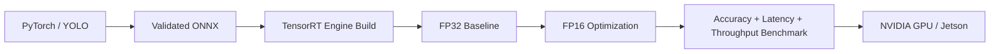

# 20 — Future TensorRT / Jetson Path

## Scope boundary

NVIDIA hardware is **not required** for EdgePPE Lab v1. The CPU ONNX path must be fully functional first.

## Future optimization path

## Concepts

### `nvidia-smi`
Host-side tool commonly used to inspect visible NVIDIA GPUs, driver version, utilization, memory usage, and processes. Absence/failure may mean no NVIDIA GPU, missing driver support, or environment exposure issues.

### CUDA driver/runtime relationship
The NVIDIA driver is host infrastructure that allows the OS/applications to communicate with the GPU. CUDA user-space runtime/toolkit versions have compatibility constraints with the installed driver. A container can package user-space CUDA libraries but still depends on a compatible host driver.

### VRAM
GPU memory used by model weights, intermediate activations/tensors, decode surfaces, and other GPU workloads. “GPU available” does not mean unlimited memory.

### TensorRT
NVIDIA inference optimizer/runtime that can transform supported network graphs into hardware-optimized engines. Engines are more hardware/runtime-specific than portable ONNX files.

### FP16
Half-precision floating point can reduce memory bandwidth/storage and improve throughput on supported GPUs, but must be benchmarked for accuracy/numerical acceptability.

### Jetson
NVIDIA edge platforms combine ARM CPU and NVIDIA GPU capabilities. Deployment adds ARM64 packaging, JetPack/runtime compatibility, device resource/thermal constraints, and often direct camera/stream integration concerns.

## What can be validated without NVIDIA hardware

- PyTorch/YOLO training on CPU (slow but functional for small lab)
- ONNX export
- ONNX Runtime CPU inference
- parity validation
- model registry/versioning
- Linux/systemd/Docker behavior
- service observability
- CI build
- rollback
- TensorRT/Jetson architecture understanding

## What cannot honestly be claimed without NVIDIA hardware

- actual TensorRT engine build success for the target device
- FP16 performance/accuracy on target GPU
- GPU utilization/VRAM behavior
- Jetson thermal/power/performance profile
- NVIDIA container runtime validation
- NVDEC decode performance

These become future experiments when compatible hardware is available.
